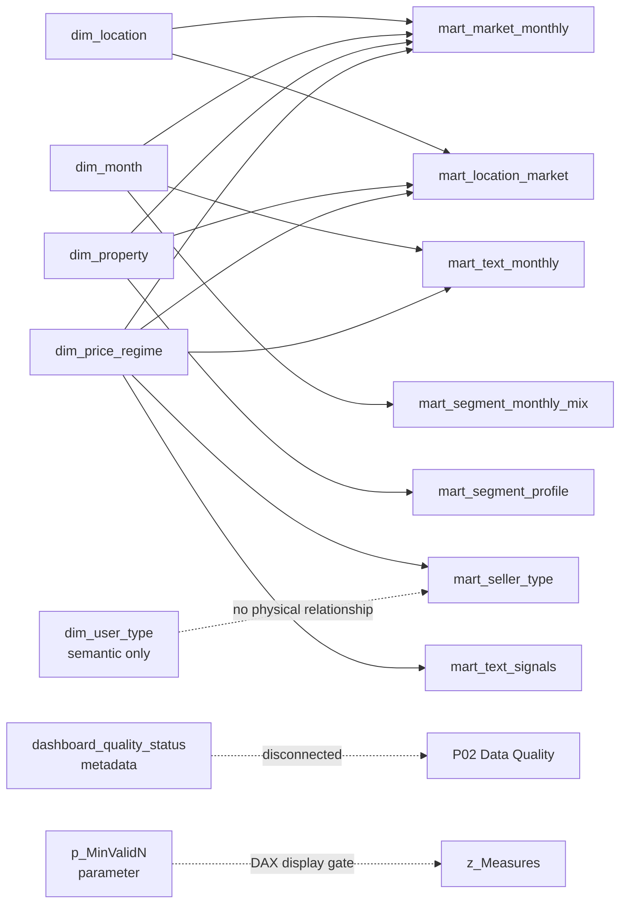

# Power BI Model Contract

## Frozen analytical data model

The analytical source layer is **exactly 10 Gold marts + 5 Gold dimensions**. Power BI reads the canonical Parquet files directly. The only additional loaded data table is the disconnected metadata table `dashboard_quality_status` for P02. Two Power BI-only helper tables (`z_Measures`, `p_MinValidN`) are calculated/disconnected and do not alter the Gold contract.

## Relationship rules

- Build **exactly 13** physical relationships from `dashboard_relationship_contract.csv`.
- Every relationship is `1:*`, `Single`, `Active`.
- Never create `Both` cross-filtering.
- `dim_user_type` remains disconnected by design.
- Do not create `dim_segment`.
- Do not create a relationship between `mart_segment_profile` and `mart_segment_monthly_mix`.
- Nullable fact keys are intentional in `mart_market_monthly` for supply-only scopes.

## Critical location-grain rule

`mart_market_monthly` contains national, city, and neighborhood aggregates. **Never sum all three entity levels together.** All primary market measures use `[Active Location Level]` to select exactly one level from the City/Neighborhood filter context.

City and Neighborhood slicers should therefore be configured as **single-select or All**. Arbitrary multi-city aggregation of a precomputed median asking price is not mathematically equivalent to a median over the union of listings and is not published by Gold.

## Formatting/model settings

- Hide technical keys and raw metric columns after measures are created; keep them available to developers.
- Sort `dim_month[month_label]` by `dim_month[chronological_sort]`.
- Use `dim_location[city_display_name]` and `neighborhood_display_name` in slicers.
- Set `dim_location[Geocode Location]` Data Category to **Place**.
- Do not import or derive exact latitude/longitude.
- Disable Auto Date/Time if possible; use `dim_month` explicitly.
- Use measure-only visuals for non-additive metrics such as medians, adjusted effects, ranks, and model diagnostics.
